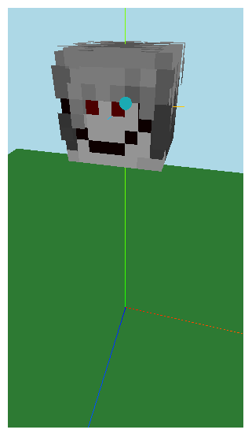

# mc-skin-viewer
Simple component which let you render any minecraft skin in your React web applications.
This component also parse [Ears mod](https://modrinth.com/mod/ears) skins and show additional 
skin elements.


## Installation
```bash
npm install mc-skin-viewer
```

## Usage
Just put a src link like `` tag and 3D model will appear in your app
```tsx
function App() {
  const [pathToSkin, setPathToSkin] = useState("/skin.png");
  const [isSlim, setSlim] = useState(true);
  
  return (
    <>
      <SkinViewer skinSrc={pathToSkin} isSlim={isSlim} />
    </>
  );
}
```

### Build your own model, set any pose
You can access to any skin component and build any scene. Use `<Canvas />` 
element from `@react-three/fibre` and build your own scene.

By default, skin-parts have default position and rotation which are bind to real skin 
position, so if you want to override this just put correct position and 
rotation.

Also, every component support debug mode. In this mode you can see mesh center
and local axes.
```tsx
import {Canvas} from "@react-three/fiber";
import {Head} from "mc-skin-viewer/skin-parts";

function App() {
  return (
    <Canvas>
      <Head position={[0,15,10]} rotation={[0,Math.PI / 2, 0]} debug />
    </Canvas>
  )
}
```


## Available skin-parts

- `Player` ready-made player model, but have less control
- `Head`
- `Body`
- `Arm` this component also takes prop with side information and is slim model
- `Leg` same as `Arm`
- `Arms`  wrapper for `Arm` skin-part, can rotate only whole wrapper
- `Legs` wrapper for `Leg` skin-part, can rotate only whole wrapper

## Contexts
If you want to work with your own model don`t forget to use required context
and wrap on it your custom model.

Required context is `SkinMaterialContext` put in provider loaded skin material.  
Optional contexts are `EarsContext` and `LayersContext`.

`EarsContext` provides information about [Ears mod](https://modrinth.com/mod/ears)
features. You don't have to wrap your custom model to a `EarsProvider`. 
However, you will receive a warning about this in the console.

`LayersContext` provides information about layer rendering. Use it if you want
to manage layer visibility